PCA Analysis - Traffic Data
================

## Initial Setup

``` r
packages <- c("tidyverse", "knitr", "ggplot2", "openxlsx", "dplyr", 
              "ggfortify", "plotly", "corrplot")
lapply(packages, require, character.only = TRUE)
```

    ## [[1]]
    ## [1] TRUE
    ## 
    ## [[2]]
    ## [1] TRUE
    ## 
    ## [[3]]
    ## [1] TRUE
    ## 
    ## [[4]]
    ## [1] TRUE
    ## 
    ## [[5]]
    ## [1] TRUE
    ## 
    ## [[6]]
    ## [1] TRUE
    ## 
    ## [[7]]
    ## [1] FALSE
    ## 
    ## [[8]]
    ## [1] TRUE

``` r
set.seed(25)

file <- "traffic.xlsx"
sheet_names <- getSheetNames(file)
print(sheet_names)
```

    ##  [1] "Loc1"  "Loc2"  "Loc3"  "Loc4"  "Loc5"  "Loc6"  "Loc7"  "Loc8"  "Loc9" 
    ## [10] "Loc10" "Loc11" "Loc12" "Loc13" "Loc14" "Loc15" "Loc16" "Loc17" "Loc18"
    ## [19] "Loc19" "Loc20" "Loc21" "Loc22" "Loc23" "Loc24" "Loc25" "Loc26"

``` r
num_sheets <- length(sheet_names)
```

## PCA Analysis for All Locations

``` r
# Initialize storage lists
pca_results <- list()
loadings_list <- list()
scores_list <- list()
components_list <- list()

for (sheet in sheet_names) {
  cat("\n\n### PCA Results for:", sheet, "\n\n")
  
  # Read data
  df <- read.xlsx(file, sheet = sheet)
  
  # Remove any non-numeric columns if present
  df_numeric <- df %>% select(where(is.numeric))
  
  # Perform PCA
  pca <- prcomp(df_numeric, center = TRUE, scale. = TRUE)
  
  # Store PCA results
  pca_results[[sheet]] <- pca
  loadings_list[[sheet]] <- pca$rotation
  scores_list[[sheet]] <- pca$x
  components_list[[sheet]] <- summary(pca)
  
  # 1. CORRELATION MATRIX HEATMAP
  cor_matrix <- cor(df_numeric, use = "complete.obs")
  cor_melted <- as.data.frame(as.table(cor_matrix))
  colnames(cor_melted) <- c("Var1", "Var2", "value")
  
  p_corr <- ggplot(cor_melted, aes(x = Var1, y = Var2, fill = value)) +
    geom_tile() +
    scale_fill_gradient2(low = "blue", mid = "white", high = "red", 
                         midpoint = 0, limits = c(-1, 1)) +
    theme_minimal() +
    theme(axis.text.x = element_text(angle = 45, hjust = 1)) +
    labs(title = paste("Correlation Matrix -", sheet),
         x = "", y = "", fill = "Correlation")
  print(p_corr)
  
  cat("\n\n")
  
  # 2. SCREE PLOT
  ve <- summary(pca)$importance[2, ]
  scree_df <- data.frame(PC = 1:length(ve), 
                         Variance = ve * 100)  # Convert to percentage
  
  p_scree <- ggplot(scree_df, aes(x = PC, y = Variance)) +
    geom_line(color = "steelblue", linewidth = 1) + 
    geom_point(size = 3, color = "steelblue") +
    labs(title = paste("Scree Plot -", sheet),
         x = "Principal Component", 
         y = "Variance Explained (%)") +
    theme_minimal() +
    scale_x_continuous(breaks = 1:length(ve))
  print(p_scree)
  
  cat("\n\n")
  
  # 3. BIPLOT
  biplot_plot <- autoplot(pca,
                          loadings = TRUE,
                          loadings.label = TRUE,
                          loadings.label.size = 3,
                          loadings.colour = "blue",
                          loadings.label.colour = "darkblue",
                          scale = 0) +
    ggtitle(paste("PCA Biplot -", sheet)) +
    theme_minimal()
  print(biplot_plot)
  
  # Print summary statistics
  cat("\n\n**Variance Explained:**\n\n")
  print(kable(summary(pca)$importance[, 1:min(5, ncol(pca$x))], 
              digits = 3))
  
  cat("\n\n---\n\n")
}
```

    ## 
    ## 
    ## ### PCA Results for: Loc1

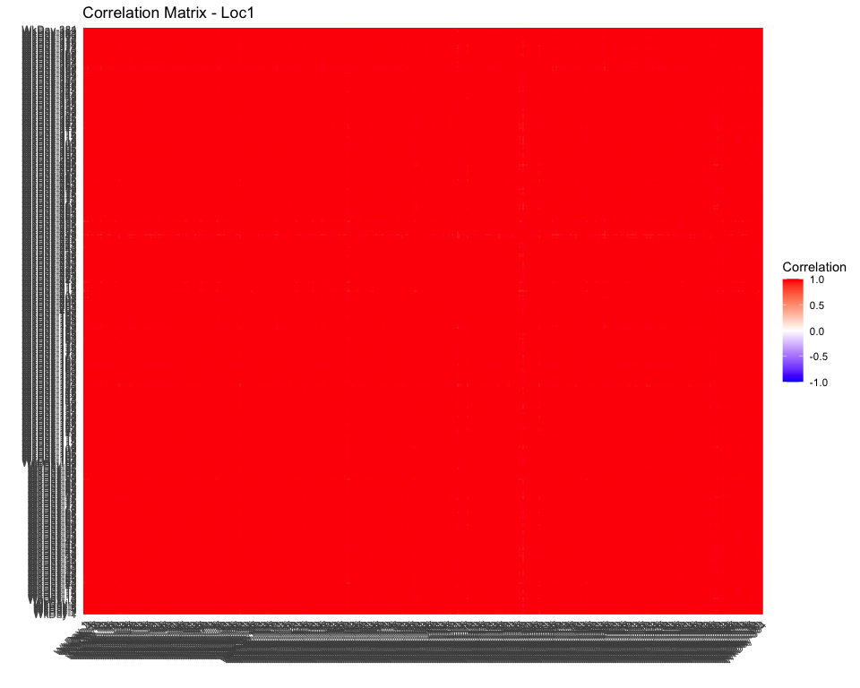<!-- -->

<!-- -->

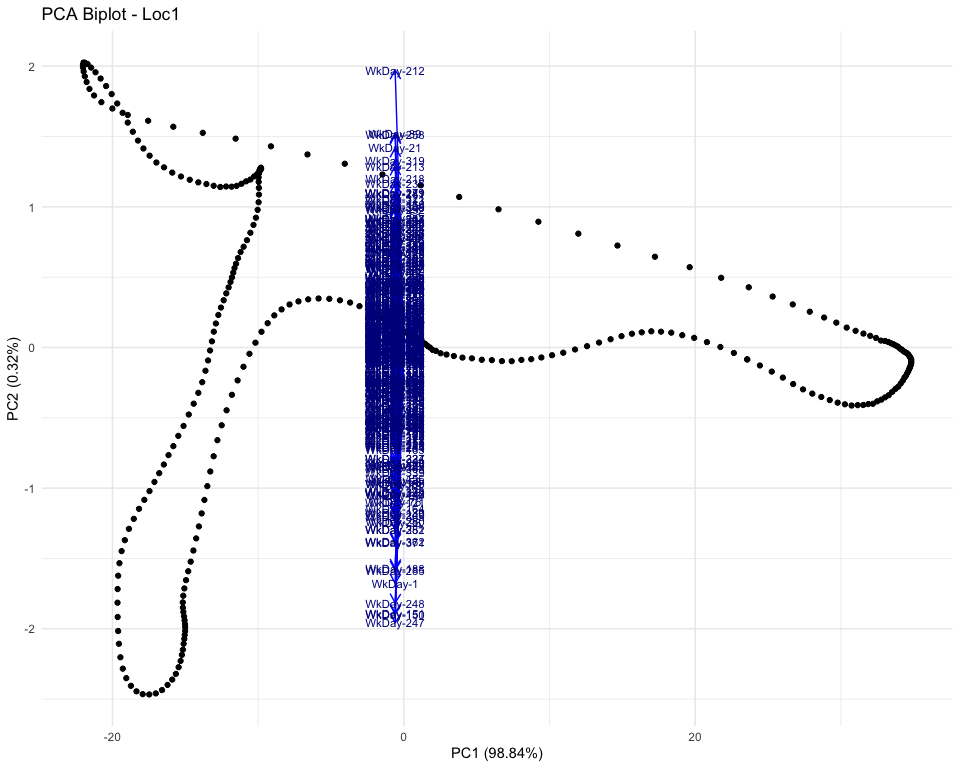<!-- -->

    ## 
    ## 
    ## **Variance Explained:**
    ## 
    ## 
    ## 
    ## |                       |    PC1|   PC2|   PC3|   PC4|   PC5|
    ## |:----------------------|------:|-----:|-----:|-----:|-----:|
    ## |Standard deviation     | 19.482| 1.109| 1.087| 0.651| 0.538|
    ## |Proportion of Variance |  0.988| 0.003| 0.003| 0.001| 0.001|
    ## |Cumulative Proportion  |  0.988| 0.992| 0.995| 0.996| 0.997|
    ## 
    ## 
    ## ---
    ## 
    ## 
    ## 
    ## ### PCA Results for: Loc2

<!-- -->

<!-- -->

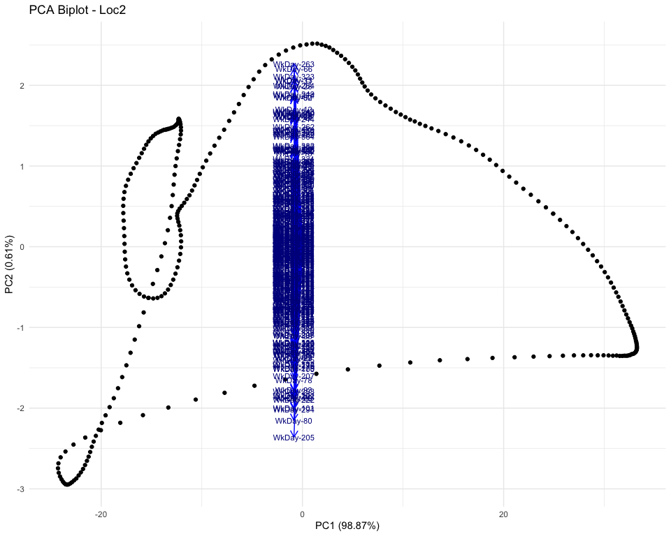<!-- -->

    ## 
    ## 
    ## **Variance Explained:**
    ## 
    ## 
    ## 
    ## |                       |    PC1|   PC2|   PC3|   PC4|   PC5|
    ## |:----------------------|------:|-----:|-----:|-----:|-----:|
    ## |Standard deviation     | 19.485| 1.535| 0.846| 0.497| 0.445|
    ## |Proportion of Variance |  0.989| 0.006| 0.002| 0.001| 0.001|
    ## |Cumulative Proportion  |  0.989| 0.995| 0.997| 0.997| 0.998|
    ## 
    ## 
    ## ---
    ## 
    ## 
    ## 
    ## ### PCA Results for: Loc3

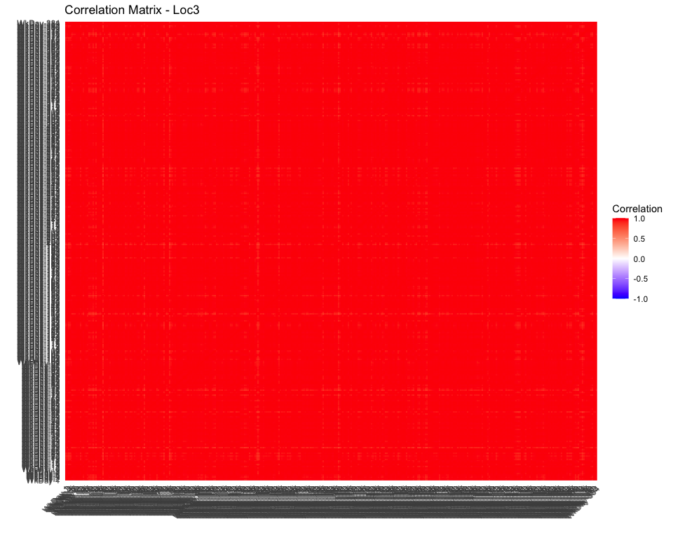<!-- -->

<!-- -->

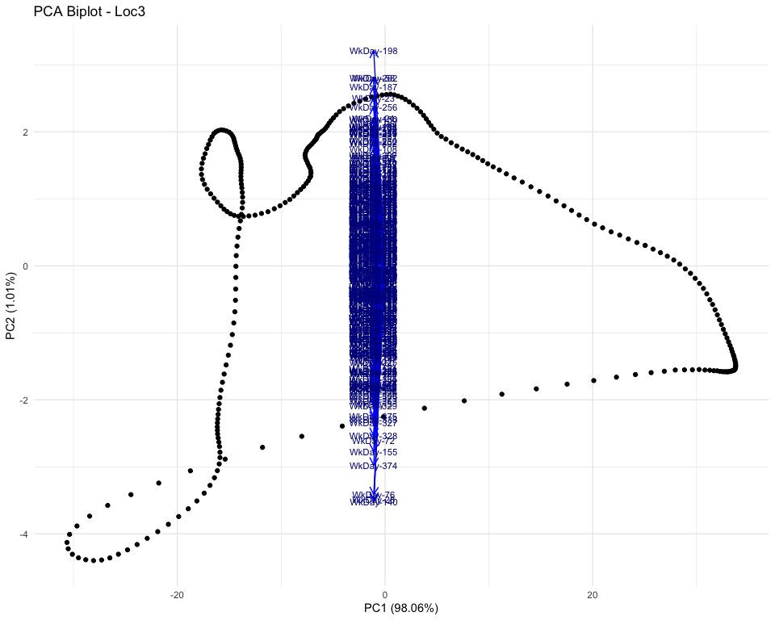<!-- -->

    ## 
    ## 
    ## **Variance Explained:**
    ## 
    ## 
    ## 
    ## |                       |    PC1|   PC2|   PC3|   PC4|   PC5|
    ## |:----------------------|------:|-----:|-----:|-----:|-----:|
    ## |Standard deviation     | 19.405| 1.973| 1.238| 0.704| 0.573|
    ## |Proportion of Variance |  0.981| 0.010| 0.004| 0.001| 0.001|
    ## |Cumulative Proportion  |  0.981| 0.991| 0.995| 0.996| 0.997|
    ## 
    ## 
    ## ---
    ## 
    ## 
    ## 
    ## ### PCA Results for: Loc4

<!-- -->

<!-- -->

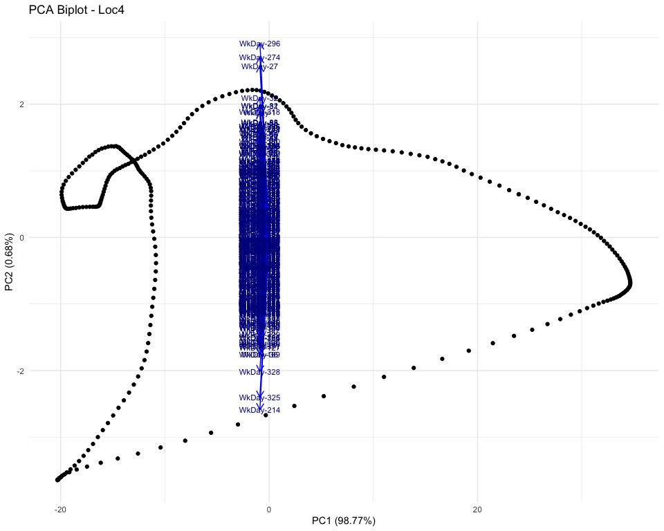<!-- -->

    ## 
    ## 
    ## **Variance Explained:**
    ## 
    ## 
    ## 
    ## |                       |    PC1|   PC2|   PC3|   PC4|   PC5|
    ## |:----------------------|------:|-----:|-----:|-----:|-----:|
    ## |Standard deviation     | 19.475| 1.619| 0.808| 0.565| 0.459|
    ## |Proportion of Variance |  0.988| 0.007| 0.002| 0.001| 0.001|
    ## |Cumulative Proportion  |  0.988| 0.994| 0.996| 0.997| 0.998|
    ## 
    ## 
    ## ---
    ## 
    ## 
    ## 
    ## ### PCA Results for: Loc5

<!-- -->

<!-- -->

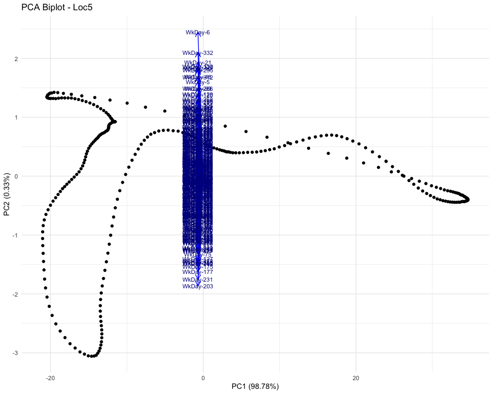<!-- -->

    ## 
    ## 
    ## **Variance Explained:**
    ## 
    ## 
    ## 
    ## |                       |    PC1|   PC2|   PC3|   PC4|   PC5|
    ## |:----------------------|------:|-----:|-----:|-----:|-----:|
    ## |Standard deviation     | 19.476| 1.132| 0.942| 0.760| 0.712|
    ## |Proportion of Variance |  0.988| 0.003| 0.002| 0.002| 0.001|
    ## |Cumulative Proportion  |  0.988| 0.991| 0.993| 0.995| 0.996|
    ## 
    ## 
    ## ---
    ## 
    ## 
    ## 
    ## ### PCA Results for: Loc6

<!-- -->

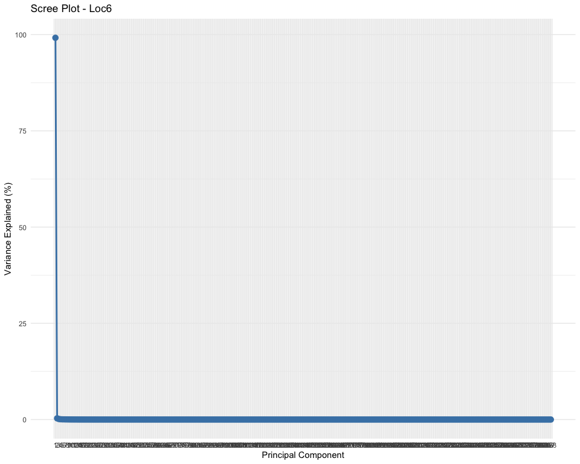<!-- -->

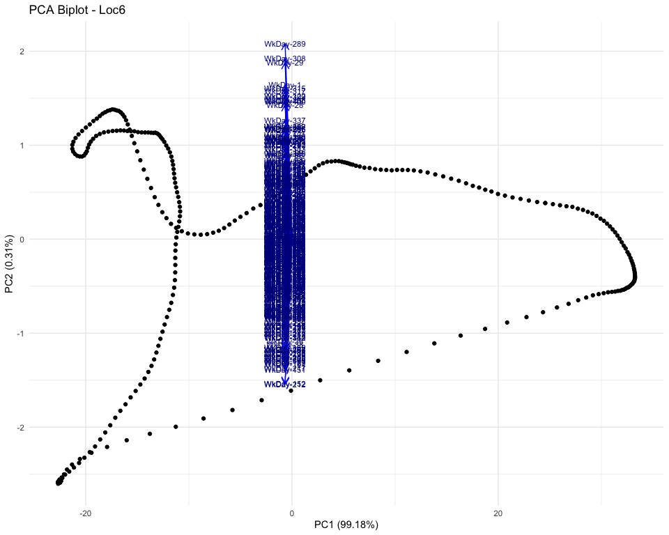<!-- -->

    ## 
    ## 
    ## **Variance Explained:**
    ## 
    ## 
    ## 
    ## |                       |    PC1|   PC2|   PC3|   PC4|   PC5|
    ## |:----------------------|------:|-----:|-----:|-----:|-----:|
    ## |Standard deviation     | 19.516| 1.097| 0.744| 0.555| 0.449|
    ## |Proportion of Variance |  0.992| 0.003| 0.001| 0.001| 0.001|
    ## |Cumulative Proportion  |  0.992| 0.995| 0.996| 0.997| 0.998|
    ## 
    ## 
    ## ---
    ## 
    ## 
    ## 
    ## ### PCA Results for: Loc7

<!-- -->

<!-- -->

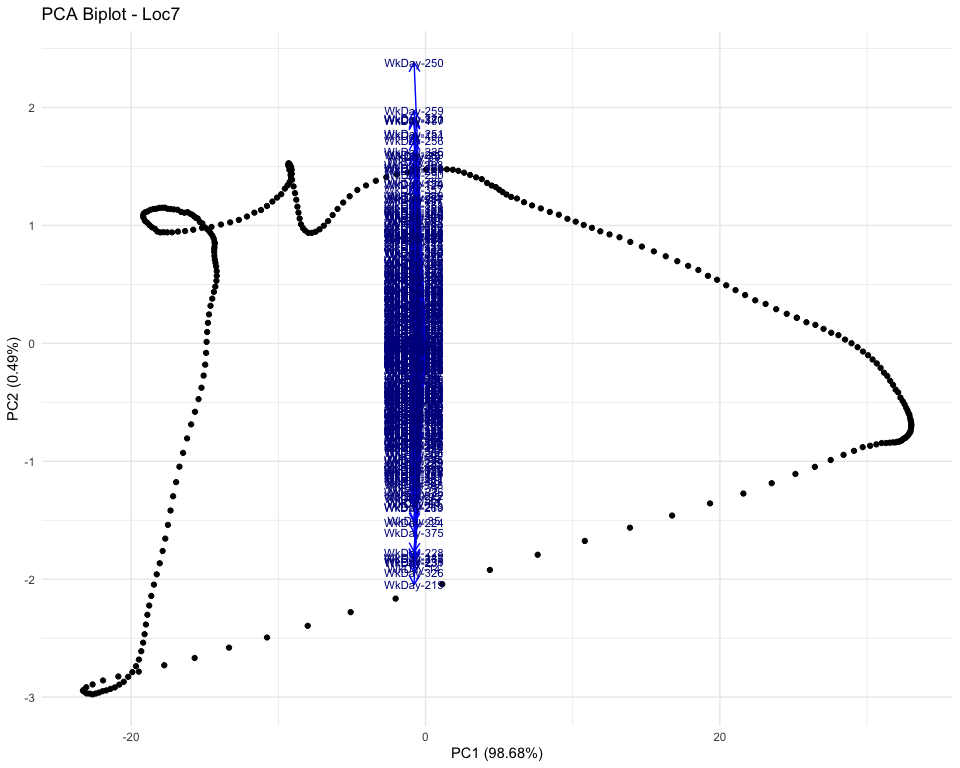<!-- -->

    ## 
    ## 
    ## **Variance Explained:**
    ## 
    ## 
    ## 
    ## |                       |    PC1|   PC2|   PC3|   PC4|   PC5|
    ## |:----------------------|------:|-----:|-----:|-----:|-----:|
    ## |Standard deviation     | 19.466| 1.375| 0.951| 0.779| 0.572|
    ## |Proportion of Variance |  0.987| 0.005| 0.002| 0.002| 0.001|
    ## |Cumulative Proportion  |  0.987| 0.992| 0.994| 0.996| 0.997|
    ## 
    ## 
    ## ---
    ## 
    ## 
    ## 
    ## ### PCA Results for: Loc8

<!-- -->

<!-- -->

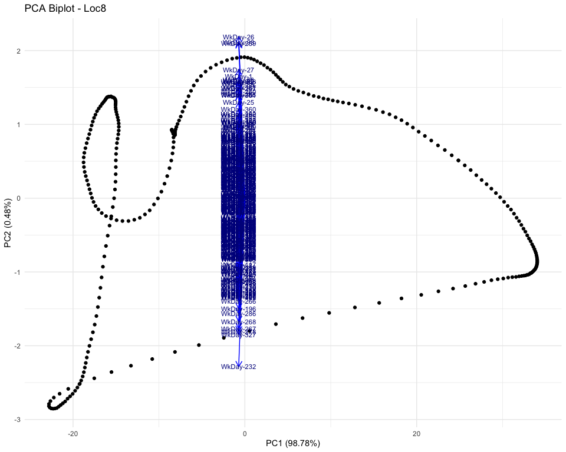<!-- -->

    ## 
    ## 
    ## **Variance Explained:**
    ## 
    ## 
    ## 
    ## |                       |    PC1|   PC2|   PC3|   PC4|   PC5|
    ## |:----------------------|------:|-----:|-----:|-----:|-----:|
    ## |Standard deviation     | 19.476| 1.361| 0.977| 0.620| 0.521|
    ## |Proportion of Variance |  0.988| 0.005| 0.002| 0.001| 0.001|
    ## |Cumulative Proportion  |  0.988| 0.993| 0.995| 0.996| 0.997|
    ## 
    ## 
    ## ---
    ## 
    ## 
    ## 
    ## ### PCA Results for: Loc9

<!-- -->

<!-- -->

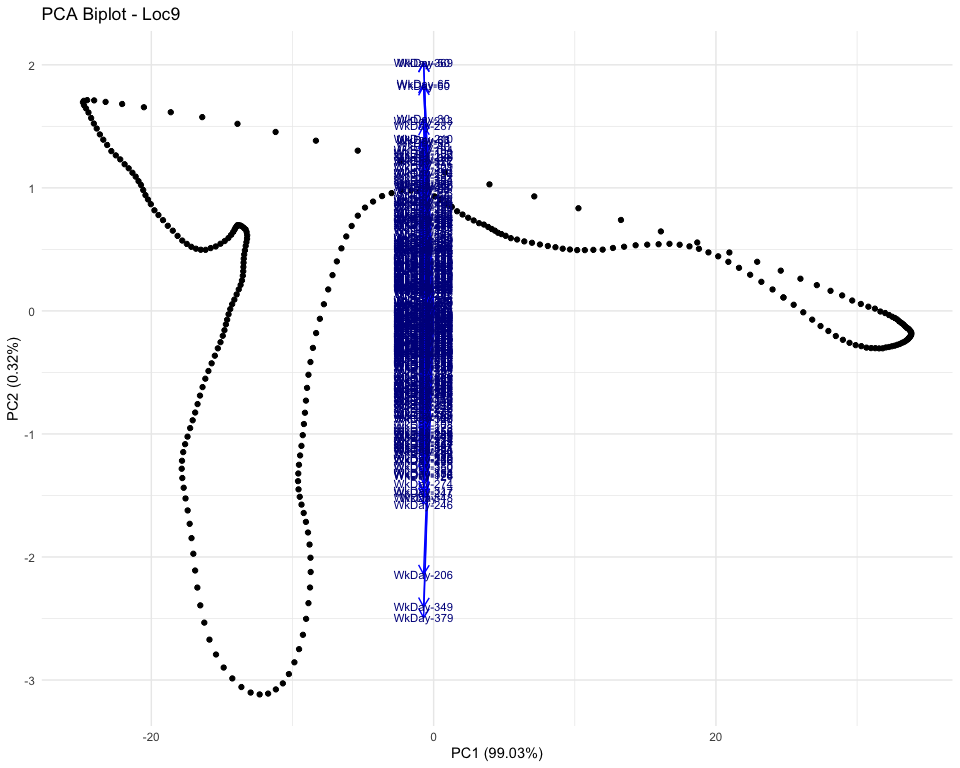<!-- -->

    ## 
    ## 
    ## **Variance Explained:**
    ## 
    ## 
    ## 
    ## |                       |    PC1|   PC2|   PC3|   PC4|   PC5|
    ## |:----------------------|------:|-----:|-----:|-----:|-----:|
    ## |Standard deviation     | 19.501| 1.101| 0.911| 0.608| 0.469|
    ## |Proportion of Variance |  0.990| 0.003| 0.002| 0.001| 0.001|
    ## |Cumulative Proportion  |  0.990| 0.993| 0.996| 0.997| 0.997|
    ## 
    ## 
    ## ---
    ## 
    ## 
    ## 
    ## ### PCA Results for: Loc10

<!-- -->

<!-- -->

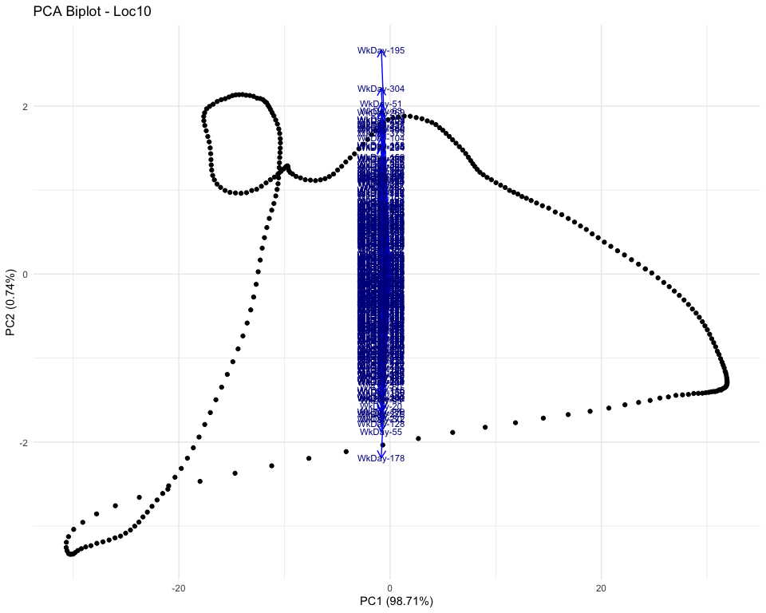<!-- -->

    ## 
    ## 
    ## **Variance Explained:**
    ## 
    ## 
    ## 
    ## |                       |    PC1|   PC2|   PC3|   PC4|   PC5|
    ## |:----------------------|------:|-----:|-----:|-----:|-----:|
    ## |Standard deviation     | 19.469| 1.686| 0.668| 0.613| 0.512|
    ## |Proportion of Variance |  0.987| 0.007| 0.001| 0.001| 0.001|
    ## |Cumulative Proportion  |  0.987| 0.994| 0.996| 0.997| 0.997|
    ## 
    ## 
    ## ---
    ## 
    ## 
    ## 
    ## ### PCA Results for: Loc11

<!-- -->

<!-- -->

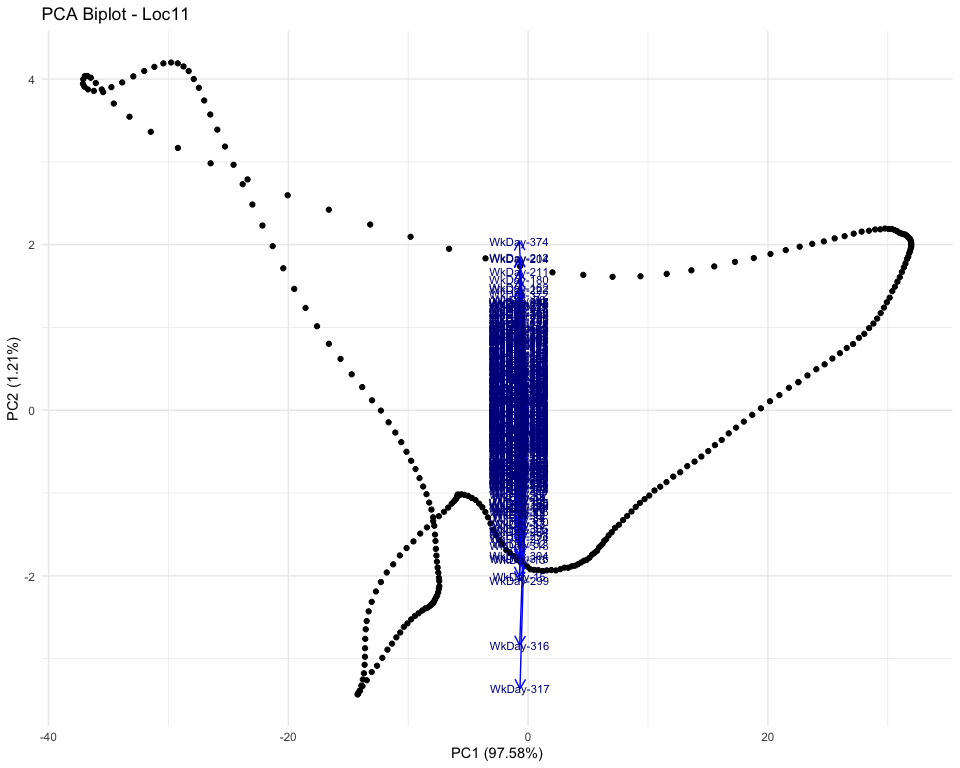<!-- -->

    ## 
    ## 
    ## **Variance Explained:**
    ## 
    ## 
    ## 
    ## |                       |    PC1|   PC2|   PC3|   PC4|   PC5|
    ## |:----------------------|------:|-----:|-----:|-----:|-----:|
    ## |Standard deviation     | 19.358| 2.157| 1.012| 0.942| 0.792|
    ## |Proportion of Variance |  0.976| 0.012| 0.003| 0.002| 0.002|
    ## |Cumulative Proportion  |  0.976| 0.988| 0.991| 0.993| 0.995|
    ## 
    ## 
    ## ---
    ## 
    ## 
    ## 
    ## ### PCA Results for: Loc12

<!-- -->

<!-- -->

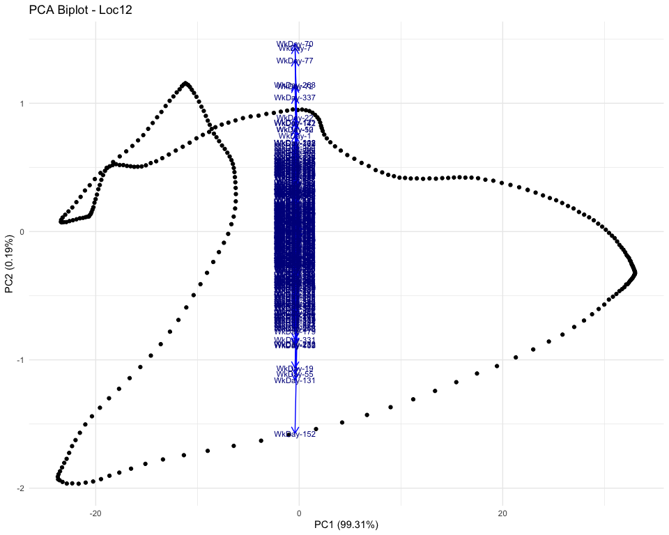<!-- -->

    ## 
    ## 
    ## **Variance Explained:**
    ## 
    ## 
    ## 
    ## |                       |    PC1|   PC2|   PC3|   PC4|   PC5|
    ## |:----------------------|------:|-----:|-----:|-----:|-----:|
    ## |Standard deviation     | 19.529| 0.850| 0.705| 0.582| 0.498|
    ## |Proportion of Variance |  0.993| 0.002| 0.001| 0.001| 0.001|
    ## |Cumulative Proportion  |  0.993| 0.995| 0.996| 0.997| 0.998|
    ## 
    ## 
    ## ---
    ## 
    ## 
    ## 
    ## ### PCA Results for: Loc13

<!-- -->

<!-- -->

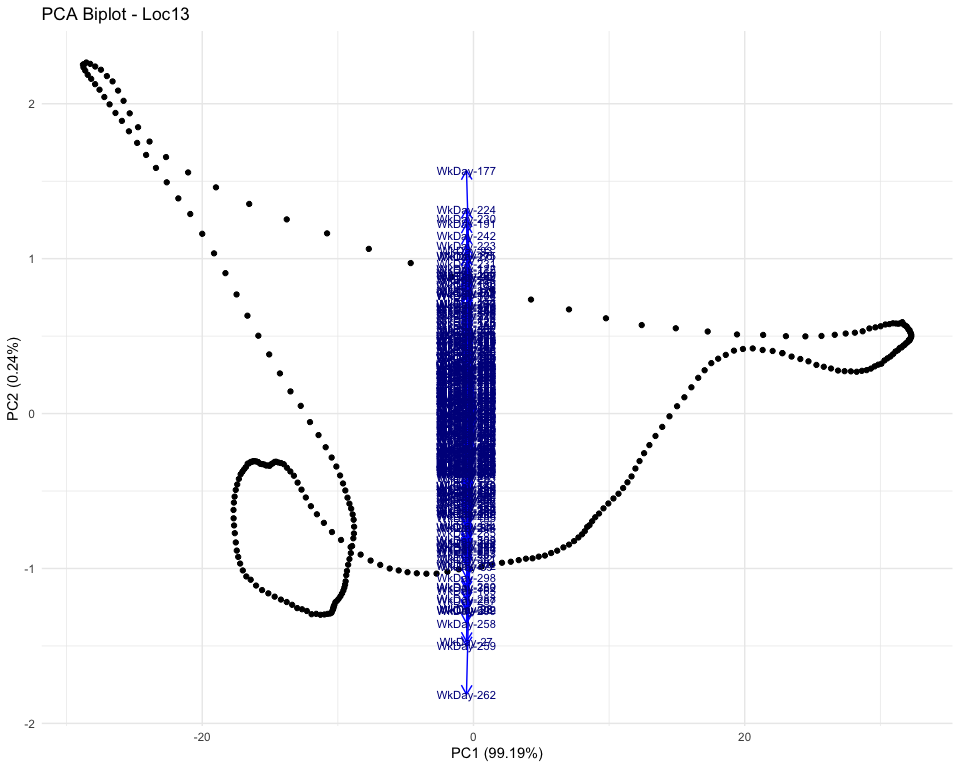<!-- -->

    ## 
    ## 
    ## **Variance Explained:**
    ## 
    ## 
    ## 
    ## |                       |    PC1|   PC2|   PC3|   PC4|   PC5|
    ## |:----------------------|------:|-----:|-----:|-----:|-----:|
    ## |Standard deviation     | 19.517| 0.953| 0.636| 0.582| 0.547|
    ## |Proportion of Variance |  0.992| 0.002| 0.001| 0.001| 0.001|
    ## |Cumulative Proportion  |  0.992| 0.994| 0.995| 0.996| 0.997|
    ## 
    ## 
    ## ---
    ## 
    ## 
    ## 
    ## ### PCA Results for: Loc14

<!-- -->

<!-- -->

<!-- -->

    ## 
    ## 
    ## **Variance Explained:**
    ## 
    ## 
    ## 
    ## |                       |    PC1|   PC2|   PC3|   PC4|   PC5|
    ## |:----------------------|------:|-----:|-----:|-----:|-----:|
    ## |Standard deviation     | 19.527| 0.889| 0.867| 0.456| 0.412|
    ## |Proportion of Variance |  0.993| 0.002| 0.002| 0.001| 0.000|
    ## |Cumulative Proportion  |  0.993| 0.995| 0.997| 0.998| 0.998|
    ## 
    ## 
    ## ---
    ## 
    ## 
    ## 
    ## ### PCA Results for: Loc15

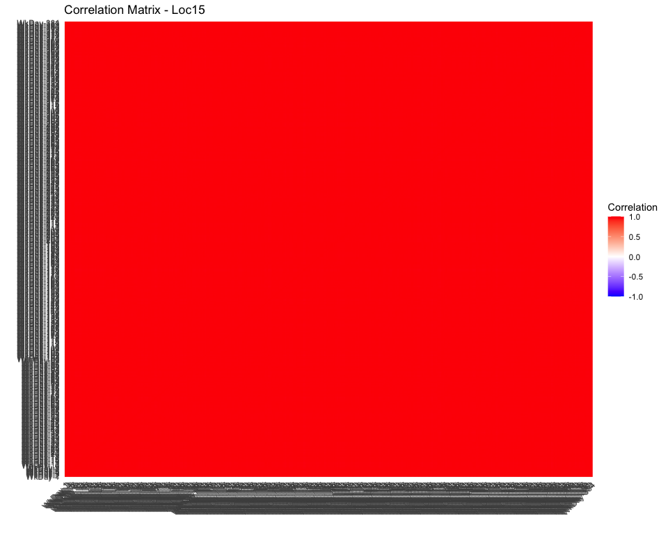<!-- -->

<!-- -->

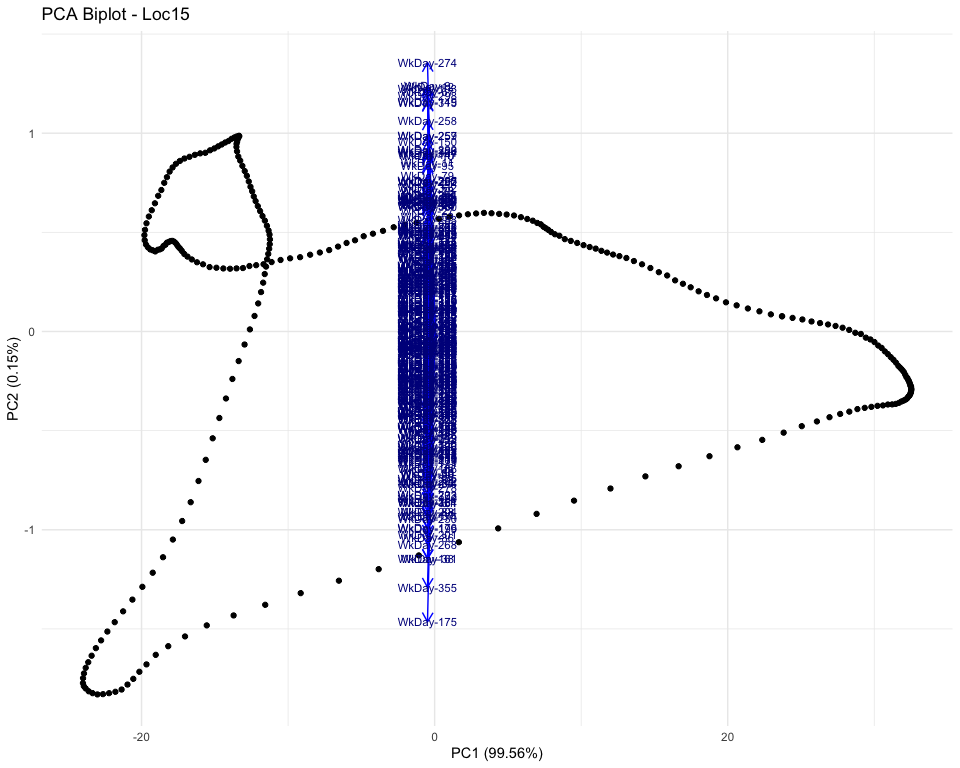<!-- -->

    ## 
    ## 
    ## **Variance Explained:**
    ## 
    ## 
    ## 
    ## |                       |    PC1|   PC2|   PC3|   PC4|   PC5|
    ## |:----------------------|------:|-----:|-----:|-----:|-----:|
    ## |Standard deviation     | 19.552| 0.763| 0.506| 0.422| 0.352|
    ## |Proportion of Variance |  0.996| 0.002| 0.001| 0.000| 0.000|
    ## |Cumulative Proportion  |  0.996| 0.997| 0.998| 0.998| 0.999|
    ## 
    ## 
    ## ---
    ## 
    ## 
    ## 
    ## ### PCA Results for: Loc16

<!-- -->

<!-- -->

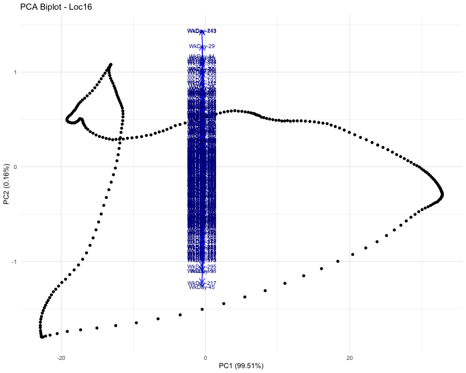<!-- -->

    ## 
    ## 
    ## **Variance Explained:**
    ## 
    ## 
    ## 
    ## |                       |    PC1|   PC2|   PC3|   PC4|   PC5|
    ## |:----------------------|------:|-----:|-----:|-----:|-----:|
    ## |Standard deviation     | 19.548| 0.785| 0.527| 0.426| 0.380|
    ## |Proportion of Variance |  0.995| 0.002| 0.001| 0.000| 0.000|
    ## |Cumulative Proportion  |  0.995| 0.997| 0.997| 0.998| 0.998|
    ## 
    ## 
    ## ---
    ## 
    ## 
    ## 
    ## ### PCA Results for: Loc17

<!-- -->

<!-- -->

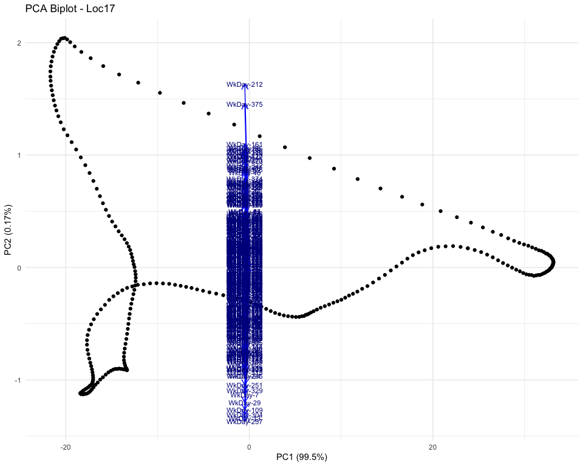<!-- -->

    ## 
    ## 
    ## **Variance Explained:**
    ## 
    ## 
    ## 
    ## |                       |    PC1|   PC2|   PC3|   PC4|   PC5|
    ## |:----------------------|------:|-----:|-----:|-----:|-----:|
    ## |Standard deviation     | 19.547| 0.803| 0.536| 0.455| 0.383|
    ## |Proportion of Variance |  0.995| 0.002| 0.001| 0.001| 0.000|
    ## |Cumulative Proportion  |  0.995| 0.997| 0.997| 0.998| 0.998|
    ## 
    ## 
    ## ---
    ## 
    ## 
    ## 
    ## ### PCA Results for: Loc18

<!-- -->

<!-- -->

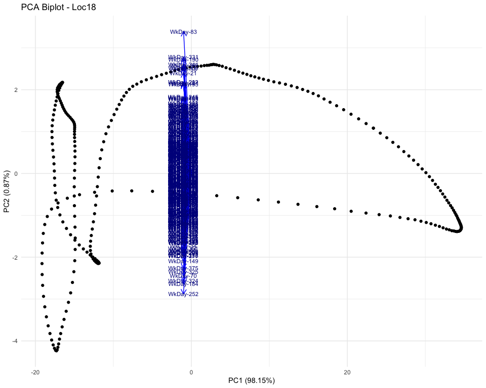<!-- -->

    ## 
    ## 
    ## **Variance Explained:**
    ## 
    ## 
    ## 
    ## |                       |    PC1|   PC2|   PC3|   PC4|   PC5|
    ## |:----------------------|------:|-----:|-----:|-----:|-----:|
    ## |Standard deviation     | 19.414| 1.827| 1.362| 0.655| 0.638|
    ## |Proportion of Variance |  0.981| 0.009| 0.005| 0.001| 0.001|
    ## |Cumulative Proportion  |  0.981| 0.990| 0.995| 0.996| 0.997|
    ## 
    ## 
    ## ---
    ## 
    ## 
    ## 
    ## ### PCA Results for: Loc19

<!-- -->

<!-- -->

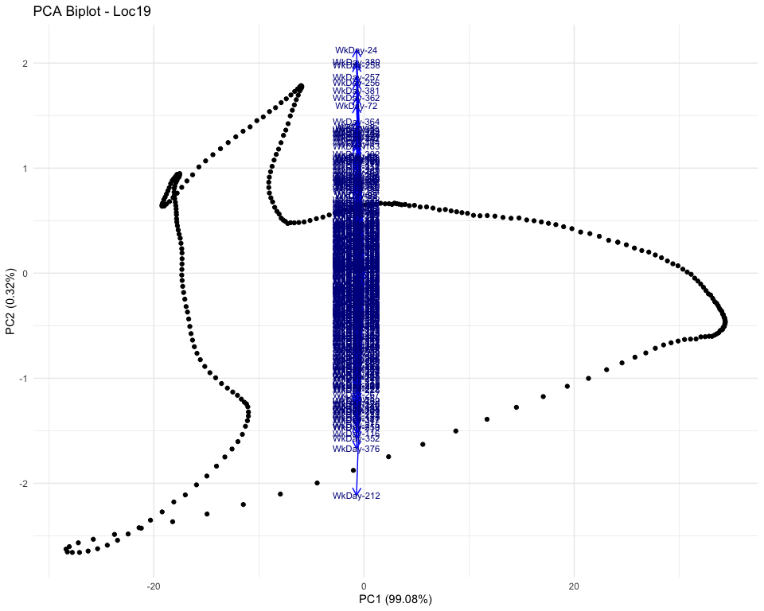<!-- -->

    ## 
    ## 
    ## **Variance Explained:**
    ## 
    ## 
    ## 
    ## |                       |    PC1|   PC2|   PC3|   PC4|   PC5|
    ## |:----------------------|------:|-----:|-----:|-----:|-----:|
    ## |Standard deviation     | 19.505| 1.106| 0.821| 0.518| 0.473|
    ## |Proportion of Variance |  0.991| 0.003| 0.002| 0.001| 0.001|
    ## |Cumulative Proportion  |  0.991| 0.994| 0.996| 0.996| 0.997|
    ## 
    ## 
    ## ---
    ## 
    ## 
    ## 
    ## ### PCA Results for: Loc20

<!-- -->

<!-- -->

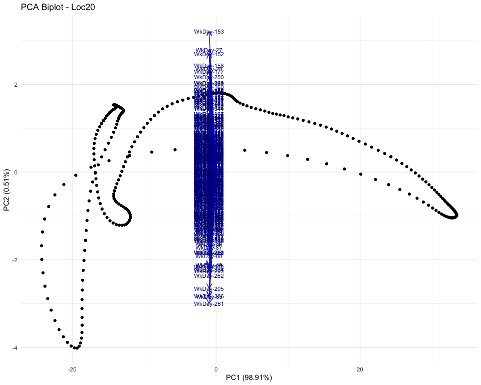<!-- -->

    ## 
    ## 
    ## **Variance Explained:**
    ## 
    ## 
    ## 
    ## |                       |    PC1|   PC2|   PC3|   PC4|   PC5|
    ## |:----------------------|------:|-----:|-----:|-----:|-----:|
    ## |Standard deviation     | 19.488| 1.403| 0.944| 0.589| 0.484|
    ## |Proportion of Variance |  0.989| 0.005| 0.002| 0.001| 0.001|
    ## |Cumulative Proportion  |  0.989| 0.994| 0.997| 0.997| 0.998|
    ## 
    ## 
    ## ---
    ## 
    ## 
    ## 
    ## ### PCA Results for: Loc21

<!-- -->

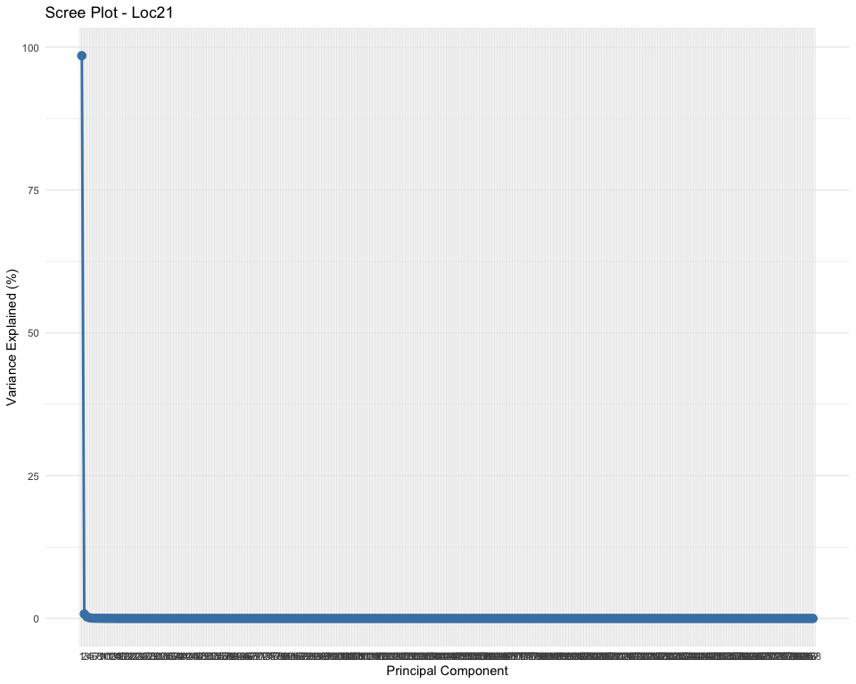<!-- -->

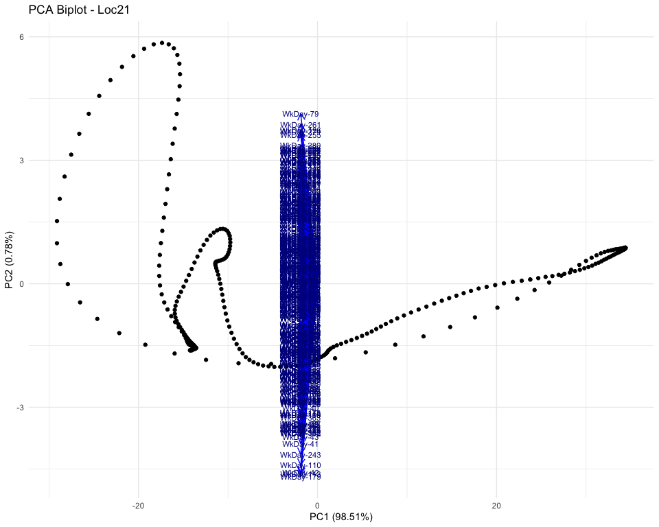<!-- -->

    ## 
    ## 
    ## **Variance Explained:**
    ## 
    ## 
    ## 
    ## |                       |    PC1|   PC2|   PC3|   PC4|   PC5|
    ## |:----------------------|------:|-----:|-----:|-----:|-----:|
    ## |Standard deviation     | 19.449| 1.734| 1.082| 0.693| 0.498|
    ## |Proportion of Variance |  0.985| 0.008| 0.003| 0.001| 0.001|
    ## |Cumulative Proportion  |  0.985| 0.993| 0.996| 0.997| 0.998|
    ## 
    ## 
    ## ---
    ## 
    ## 
    ## 
    ## ### PCA Results for: Loc22

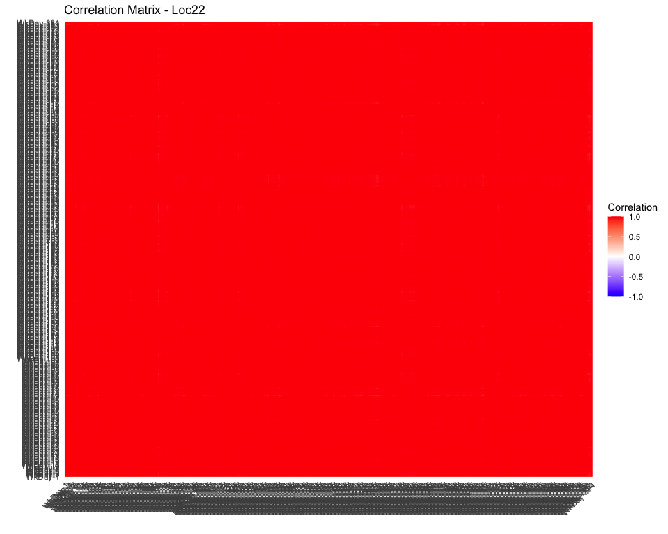<!-- -->

<!-- -->

<!-- -->

    ## 
    ## 
    ## **Variance Explained:**
    ## 
    ## 
    ## 
    ## |                       |    PC1|   PC2|   PC3|   PC4|   PC5|
    ## |:----------------------|------:|-----:|-----:|-----:|-----:|
    ## |Standard deviation     | 19.503| 1.331| 0.889| 0.521| 0.415|
    ## |Proportion of Variance |  0.991| 0.005| 0.002| 0.001| 0.000|
    ## |Cumulative Proportion  |  0.991| 0.995| 0.997| 0.998| 0.998|
    ## 
    ## 
    ## ---
    ## 
    ## 
    ## 
    ## ### PCA Results for: Loc23

<!-- -->

<!-- -->

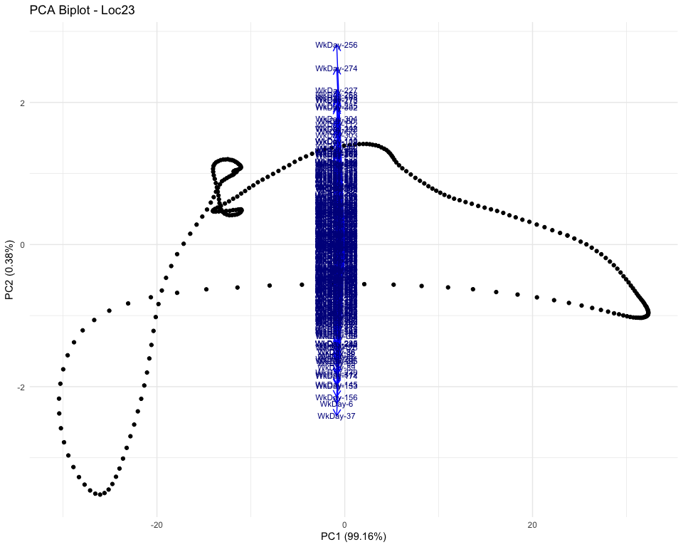<!-- -->

    ## 
    ## 
    ## **Variance Explained:**
    ## 
    ## 
    ## 
    ## |                       |    PC1|   PC2|   PC3|   PC4|   PC5|
    ## |:----------------------|------:|-----:|-----:|-----:|-----:|
    ## |Standard deviation     | 19.513| 1.210| 0.783| 0.494| 0.447|
    ## |Proportion of Variance |  0.992| 0.004| 0.002| 0.001| 0.001|
    ## |Cumulative Proportion  |  0.992| 0.995| 0.997| 0.998| 0.998|
    ## 
    ## 
    ## ---
    ## 
    ## 
    ## 
    ## ### PCA Results for: Loc24

<!-- -->

<!-- -->

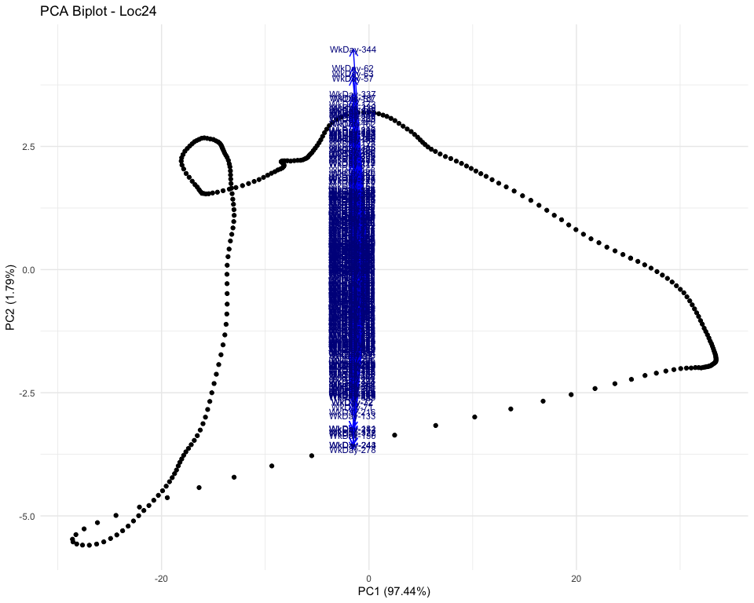<!-- -->

    ## 
    ## 
    ## **Variance Explained:**
    ## 
    ## 
    ## 
    ## |                       |    PC1|   PC2|   PC3|   PC4|   PC5|
    ## |:----------------------|------:|-----:|-----:|-----:|-----:|
    ## |Standard deviation     | 19.343| 2.622| 1.003| 0.672| 0.543|
    ## |Proportion of Variance |  0.974| 0.018| 0.003| 0.001| 0.001|
    ## |Cumulative Proportion  |  0.974| 0.992| 0.995| 0.996| 0.997|
    ## 
    ## 
    ## ---
    ## 
    ## 
    ## 
    ## ### PCA Results for: Loc25

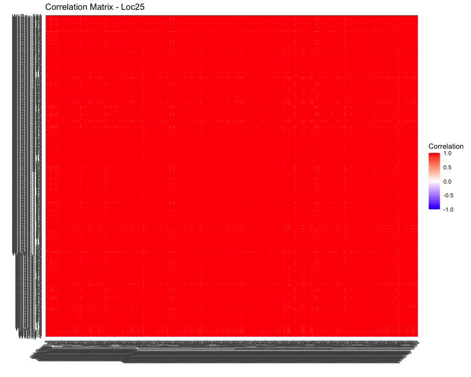<!-- -->

<!-- -->

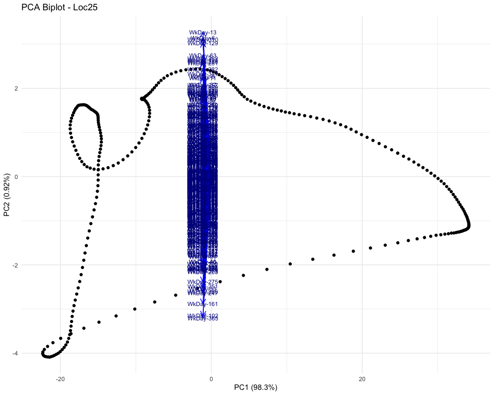<!-- -->

    ## 
    ## 
    ## **Variance Explained:**
    ## 
    ## 
    ## 
    ## |                       |    PC1|   PC2|   PC3|   PC4|   PC5|
    ## |:----------------------|------:|-----:|-----:|-----:|-----:|
    ## |Standard deviation     | 19.429| 1.876| 1.010| 0.666| 0.532|
    ## |Proportion of Variance |  0.983| 0.009| 0.003| 0.001| 0.001|
    ## |Cumulative Proportion  |  0.983| 0.992| 0.995| 0.996| 0.997|
    ## 
    ## 
    ## ---
    ## 
    ## 
    ## 
    ## ### PCA Results for: Loc26

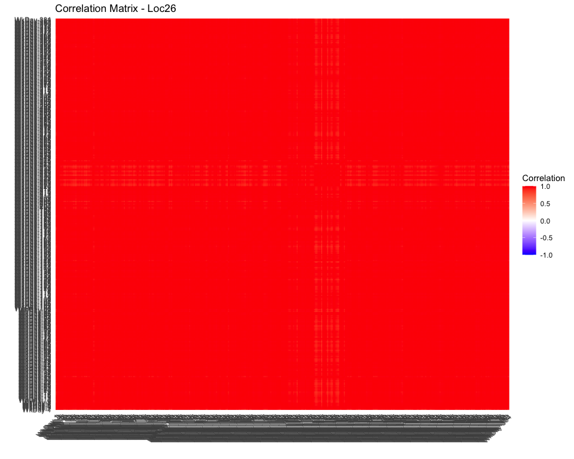<!-- -->

<!-- -->

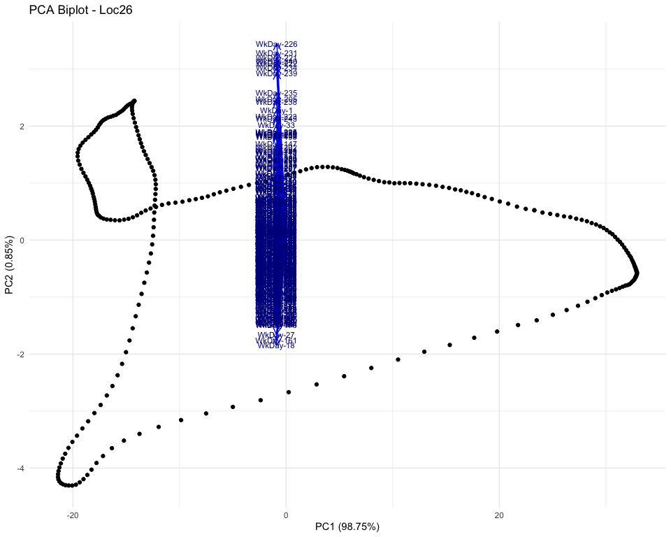<!-- -->

    ## 
    ## 
    ## **Variance Explained:**
    ## 
    ## 
    ## 
    ## |                       |    PC1|   PC2|   PC3|   PC4|   PC5|
    ## |:----------------------|------:|-----:|-----:|-----:|-----:|
    ## |Standard deviation     | 19.473| 1.802| 0.667| 0.544| 0.382|
    ## |Proportion of Variance |  0.987| 0.008| 0.001| 0.001| 0.000|
    ## |Cumulative Proportion  |  0.987| 0.996| 0.997| 0.998| 0.998|
    ## 
    ## 
    ## ---

## Summary

All PCA results have been stored in the following objects:

- `pca_results`: List containing all PCA objects
- `loadings_list`: List of loading matrices for each sheet
- `scores_list`: List of score matrices (PC coordinates) for each sheet
- `components_list`: List of summary statistics for each sheet

``` r
cat("Number of sheets analyzed:", length(pca_results), "\n")
```

    ## Number of sheets analyzed: 26

``` r
cat("Sheet names:", paste(names(pca_results), collapse = ", "), "\n")
```

    ## Sheet names: Loc1, Loc2, Loc3, Loc4, Loc5, Loc6, Loc7, Loc8, Loc9, Loc10, Loc11, Loc12, Loc13, Loc14, Loc15, Loc16, Loc17, Loc18, Loc19, Loc20, Loc21, Loc22, Loc23, Loc24, Loc25, Loc26

## Accessing Stored Data

You can access specific results using list indexing:

``` r
# Example: Access PCA results for first sheet
first_sheet <- sheet_names[1]
loadings_first <- loadings_list[[first_sheet]]
scores_first <- scores_list[[first_sheet]]
components_first <- components_list[[first_sheet]]
```
